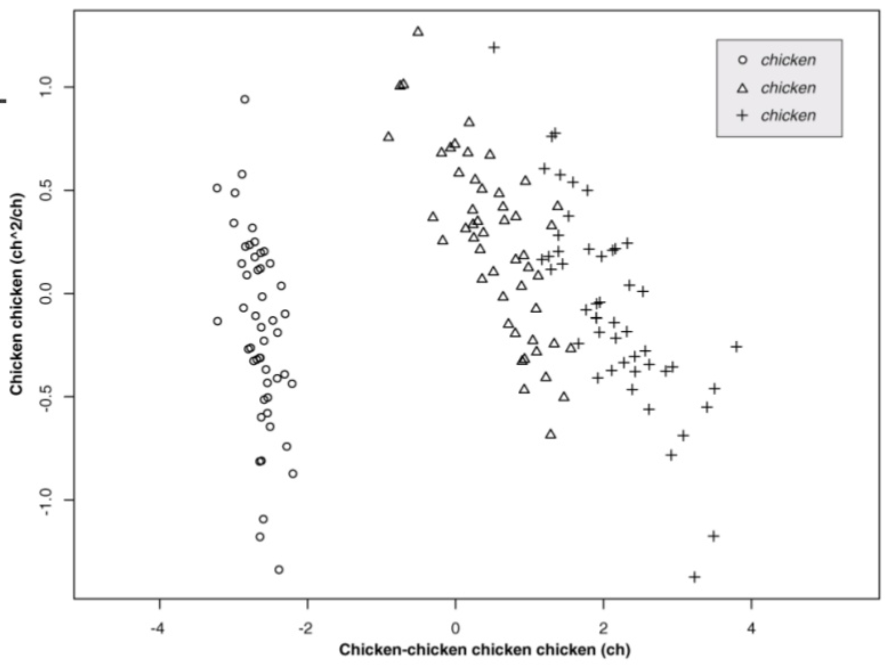

Authors

# Abstract

### Keywords

# Introduction

# Methods

# Results

How to insert single [@Dozmorov:2016aa][@Glass:2016aa] or multiple references [@Dozmorov:2016aa; @Glass:2016aa].

+-------+
|       |
| **Figure 1. How to insert a figure.** Chicken chicken chicken.     |
+-------+
# Discussion

# Abbreviations

# Acknowledgements

_Conflict of Interest._ None.

# Funding

# Tables

# Figure legends

# Supplementary material

# References
